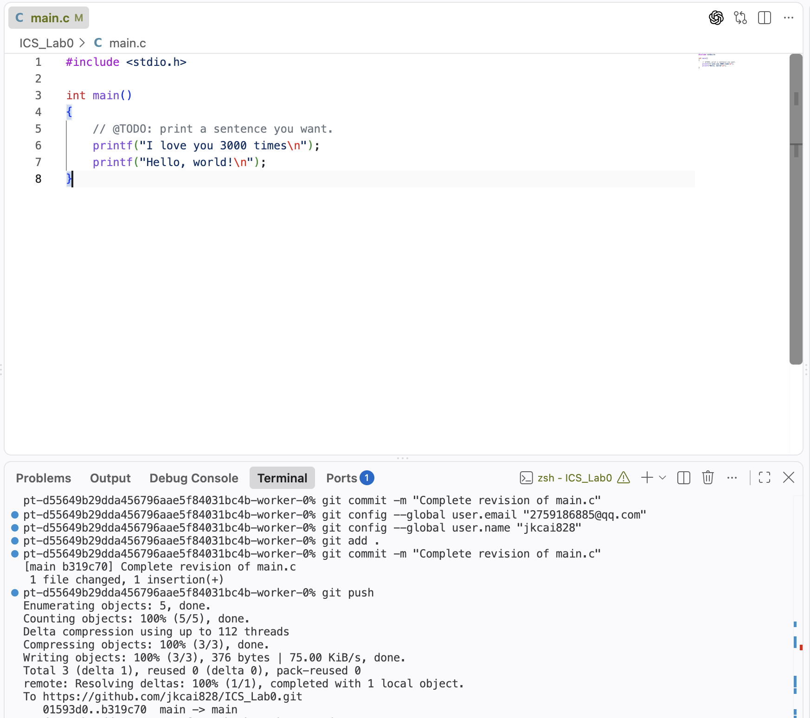
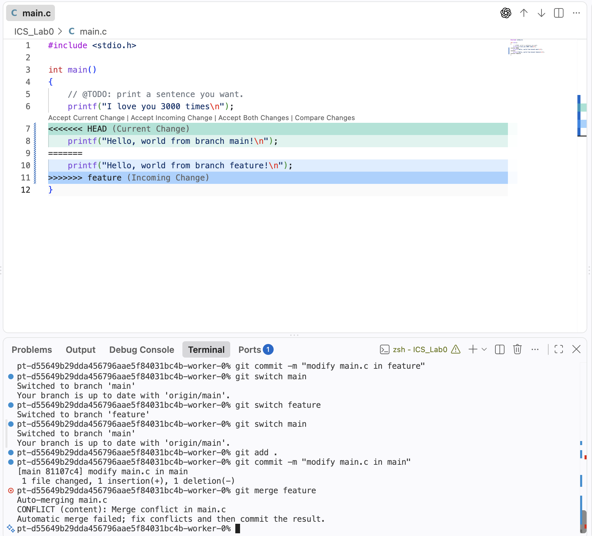
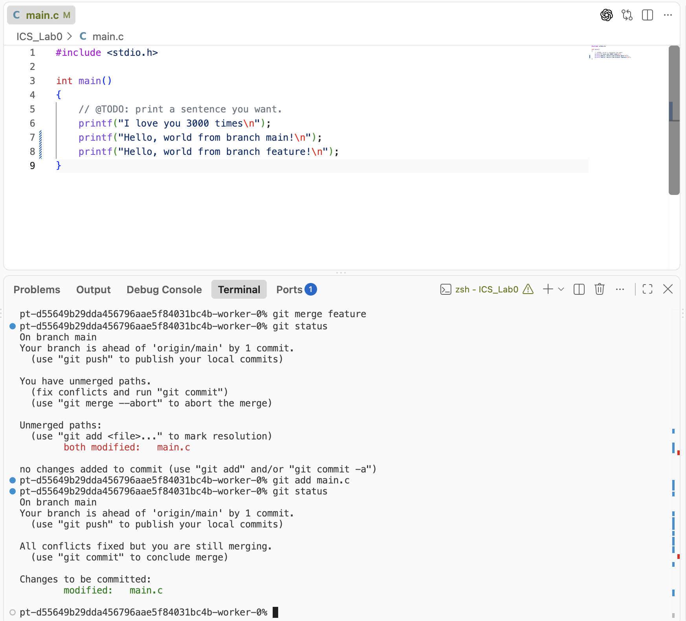
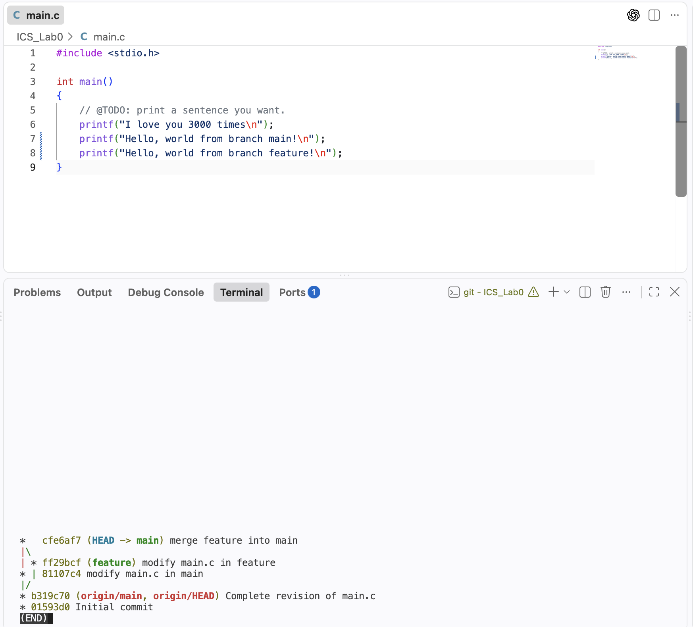

# Lab0：GitLab 实验报告

姓名：蔡纪坤  
学号：24300810016
日期：2026 年 9 月 25 日  

## 1. 实验目的

本实验的主要目的是学习 Git 与 GitHub 的基本使用方法，包括 Git 配置、工作区与暂存区、提交（commit）、分支（branch）、分支切换、合并（merge）、冲突（conflict）处理以及远程仓库的 push 操作。通过本实验，我进一步理解了版本控制在个人开发和多人协作中的作用。

---

## 2. 文档问题回答

### 2.1 你之前有过多人协同开发的经历吗？如果有，你们是使用什么方式分工协作的？

我之前有过多人协同开发的经历。一般会使用 Git 和 GitHub 维护同一个项目，不同成员负责不同模块或功能。开发时可以各自在独立分支上修改代码，完成后通过 merge 或 Pull Request 合并到主分支。这样能够减少不同成员直接修改同一份代码造成的相互覆盖，同时也可以通过 commit 记录追踪每个人的修改。


### 2.2 Git 为什么要设计“暂存—提交”两个步骤？

我认为暂存区的主要作用是让开发者在真正提交之前，对“这一次提交究竟包含哪些修改”进行选择和组织。

例如，我可能同时修改了 `main.c`、`README.md` 和其他文件，但其中只有 `main.c` 的修改属于当前要完成的功能。此时可以只执行：

```bash
git add main.c
git commit -m "complete TODO in main.c"
```

这样本次 commit 中只包含 `main.c` 的修改，而其他未暂存的修改仍留在工作区。

因此，`git add` 和 `git commit` 分成两个步骤，可以让一次 commit 对应一个相对完整、明确的逻辑修改，使提交历史更加清晰，也便于之后进行代码审查、回退和问题定位。

### 2.3 `git branch` 和 `git branch -a` 的区别是什么？

`git branch` 默认显示当前仓库中的**本地分支**，并使用 `*` 标记当前所在分支。

`git branch -a` 中的 `-a` 表示 `--all`，除了显示本地分支以外，还会显示远程跟踪分支，例如：

```text
* main
  feature
  remotes/origin/main
```

因此，两者的主要区别是：

- `git branch`：查看本地分支；
- `git branch -a`：查看本地分支以及远程跟踪分支。

---

## 3. 基本 Git 操作与 TODO 修改

### 3.1 克隆并检查仓库

首先将 GitHub 上的个人仓库克隆到本地，并进入项目目录：

```bash
git clone git@github.com:jkcai828/ICS_Lab0.git
cd ICS_Lab0
```

使用：

```bash
git status
git branch
git remote -v
```

检查当前分支和远程仓库配置。

### 3.2 完成 `main.c` 中的 TODO

原始代码中要求在 `main.c` 中输出一句自定义文本。我加入了：

```c
printf("I love you 3000 times\n");
```

之后使用：

```bash
git diff
```

检查修改，并将修改加入暂存区：

```bash
git add main.c
```

随后提交：

```bash
git commit -m "Complete revision of main.c"
```

如有需要，可以使用以下命令编译并运行程序：

```bash
make
./main
make clean
```

**截图 1：TODO 修改以及第一次提交**



---

## 4. 阅读材料与对 Git 的理解

本实验从给出的三篇材料中选择了以下两篇进行阅读：

1. 《Commit message 和 Change log 编写指南》
2. 《Gitflow 使用规范》

### 4.1 Commit Message 规范

Commit message 用于说明一次提交的目的。清晰、规范的 commit message 可以让项目的历史记录更容易阅读，也方便根据提交类型查找修改，并能够进一步用于自动生成 Change Log。

一种常见的格式为：

```text
<type>(<scope>): <subject>
```

其中 `type` 可以表示提交的种类，例如：

- `feat`：新增功能；
- `fix`：修复问题；
- `docs`：文档修改；
- `style`：不影响程序逻辑的格式修改；
- `refactor`：代码重构；
- `test`：测试相关修改；
- `chore`：构建或辅助工具相关修改。

我认为 commit message 的意义不仅是描述“改了什么”，更重要的是帮助之后阅读代码历史的人快速理解“为什么进行这次修改”。

### 4.2 Git Flow 分支管理

Git Flow 是一种利用不同 Git 分支管理软件开发过程的工作方式。典型分支包括：

- `master/main`：保存稳定、可发布的版本；
- `develop`：日常开发集成分支；
- `feature`：用于开发独立新功能；
- `release`：用于发布前测试和整理；
- `hotfix`：用于紧急修复已经发布版本中的问题。

其中 feature 分支通常从开发分支创建，功能完成后再合并回开发分支。这样可以使不同功能的开发相互隔离，避免所有开发者直接在主分支上修改代码。

本次实验虽然规模很小，但创建 `feature` 分支并最终合并回 `main` 的过程，使我直观地体验了这种“在独立分支开发，再进行合并”的思想。

### 4.3 为什么要学习 Git

我认为学习 Git 的主要意义有以下几点：

第一，Git 可以完整保存项目的修改历史。每次 commit 都形成一个明确的版本，在出现错误时可以查看过去的修改甚至恢复到之前的状态。

第二，Git 能够帮助开发者组织代码修改。借助暂存区和 commit，可以把不同目的的修改拆分成清楚的版本记录。

第三，Git 的 branch 和 merge 为多人协作提供了基础。不同开发者可以在独立分支上工作，之后再将修改合并，从而减少互相覆盖代码的情况。

第四，Git 与 GitHub 配合后，可以实现远程代码托管、备份和协作。对于之后更复杂的课程实验以及实际软件开发，Git 都是非常重要的基础工具。

---

## 5. 分支管理与 Merge Conflict

### 5.1 创建 `feature` 分支

首先从 `main` 创建并切换到新的 `feature` 分支：

```bash
git switch -c feature
```

使用：

```bash
git branch
```

可以看到当前位于 `feature` 分支。

### 5.2 在 `feature` 分支修改并提交

为了之后主动制造 merge conflict，我在 `feature` 分支中修改了 `main.c` 的同一位置，例如加入：

```c
printf("Hello, world from branch feature!\n");
```

然后执行：

```bash
git add main.c
git commit -m "modify main.c in feature"
```

### 5.3 在 `main` 分支修改并提交

随后切换回 `main`：

```bash
git switch main
```

在 `main.c` 的相同位置做不同的修改，例如：

```c
printf("Hello, world from branch main!\n");
```

然后提交：

```bash
git add main.c
git commit -m "modify main.c in main"
```

此时 `main` 与 `feature` 从共同的历史版本分叉，并且分别修改了同一文件的同一位置。

### 5.4 合并 `feature` 并产生冲突

在 `main` 分支执行：

```bash
git merge feature
```

Git 提示：

```text
CONFLICT (content): Merge conflict in main.c
Automatic merge failed; fix conflicts and then commit the result.
```

打开 `main.c` 后，可以看到类似下面的冲突标记：

```c
<<<<<<< HEAD
printf("Hello, world from branch main!\n");
=======
printf("Hello, world from branch feature!\n");
>>>>>>> feature
```

其中 `HEAD` 一侧表示当前 `main` 分支中的内容，另一侧表示准备合并进来的 `feature` 分支内容。由于两个分支修改了同一位置，Git 无法自动判断应该保留哪一个版本，因此需要人工处理。

**截图 2：执行 `git merge feature` 后出现 CONFLICT**



**截图 3：VSCode 中显示冲突标记**


### 5.5 解决冲突

在本实验中，我选择同时保留两个分支的输出，因此将冲突部分修改为：

```c
printf("Hello, world from branch main!\n");
printf("Hello, world from branch feature!\n");
```

并删除 Git 自动插入的：

```text
<<<<<<< HEAD
=======
>>>>>>> feature
```

等冲突标记。

之后执行：

```bash
git add main.c
git status
```

此时 Git 会识别到冲突已经处理完成。最后创建 merge commit：

```bash
git commit -m "merge feature into main"
```

使用：

```bash
git log --oneline --graph --all
```

可以看到 `main` 与 `feature` 两条分支最终重新合并到一起。

**截图 4：解决冲突后的 `main.c`**



**截图 5：最终 Git 提交图**



```bash
git log --oneline --graph --decorate --all
```

---

## 6. 提交到远程仓库

完成代码与实验报告后，确认当前处于 `main` 分支：

```bash
git switch main
git status
```

将本实验报告加入仓库并提交：

```bash
git add .
git commit -m "add Lab0 report"
```

随后推送到 GitHub：

```bash
git push origin main
```

最后在 GitHub 上检查：

1. `main.c` 是否已经包含最终修改；
2. 实验报告是否位于 `main` 分支；
3. commit 历史是否包含 TODO 修改、两个分支的修改以及 merge commit；
4. 实验报告中的截图是否能够正常显示。

---

## 7. 实验总结

通过本次实验，我完成了从修改文件、暂存、提交，到创建分支、切换分支、合并分支和手动解决冲突的完整 Git 工作流。

在实验前，我对 Git 的理解更多停留在 `add`、`commit` 和 `push` 等命令层面。通过主动让 `main` 和 `feature` 修改 `main.c` 的同一位置并制造 conflict，我进一步理解了分支实际上可以保存不同的开发历史，而 merge 的作用是将这些历史重新整合。当 Git 无法自动合并时，需要开发者根据代码语义决定最终结果。

本实验也让我认识到，一个清晰的 commit 历史、合理的分支管理方式以及规范的 commit message，不仅能够保存代码，更能够帮助个人和团队理解整个项目的开发过程。
